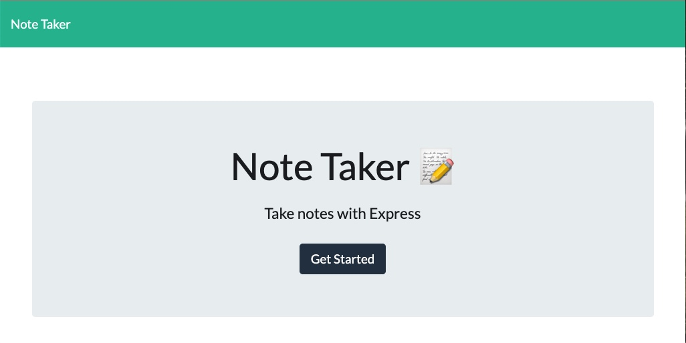
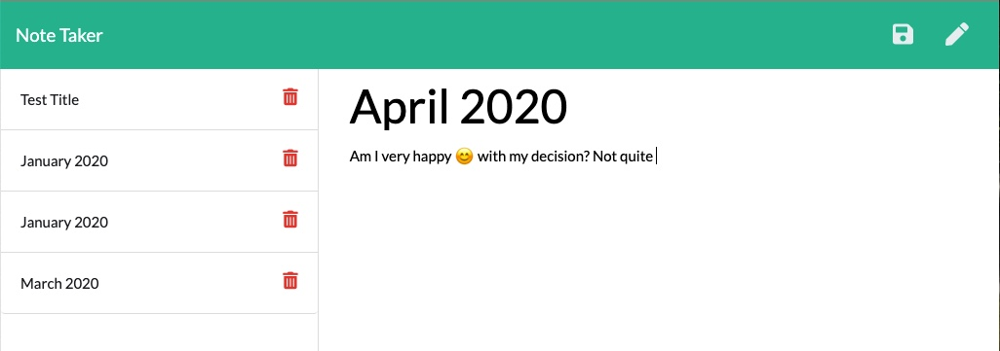

# NoteTaker

_After adding the necessary dependancies, running node app.js will start the app and the user will be notify in the terminal to open it on pert 3000._

_The user will be presented with a page and after clicking **Get Started** The user will have the page to ender their note._

_The user can enter the tittle of their notes on the **Note Title** section, and the body on the **Note Text** section._

_Clicking on the **Pencil icon** will reset the note the user is currently taking, the **save icon** will save the note to the page and notify the terminal; reload the page to enter additional notes._

# Demo

# Technologies used

**Github**

**Npm**

**Css**

**Html**

**Javascrip**

**Node.js**

# Links

[deployed website](https://snubia.github.io/Taker/)

[Github repository](https://github.com/Snubia/Taker.git)

# Contact Me

**_for feedback, contributions or questions_**

**Email:** nunubabila@gmail.com

[Linkedin](https://www.linkedin.com/in/sandrine-nubia-975aa2172/)

